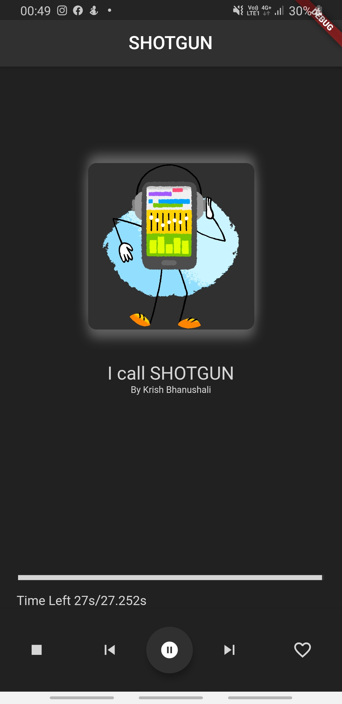

# Shotgun

A new Flutter application that lets you to play music using URL

# Introduction
This is a app I made from scratch , it can play audio files from a URL entered and is fully functional as can perform pause,play,stop and a progress bar. It took me few hours but I learnt alot and again The future releases will have:
- I will try to add an app icon and improve the UI and add timee in min,sec
- Add name of the song and image of it too
- try to add feature for the buttons that are not working
- as I learn routing I will allow user to get more songs and often create a list
- this only plays from the online link hence I will have functionality to play from the local file
- future goal to make it a fully fleshed app

# Visual
This is from the physical andriod device:

## Getting Started

This project is a starting point for a Flutter application.

A few resources to get you started if this is your first Flutter project:

- [Lab: Write your first Flutter app](https://flutter.dev/docs/get-started/codelab)
- [Cookbook: Useful Flutter samples](https://flutter.dev/docs/cookbook)

For help getting started with Flutter, view our
[online documentation](https://flutter.dev/docs), which offers tutorials,
samples, guidance on mobile development, and a full API reference.
